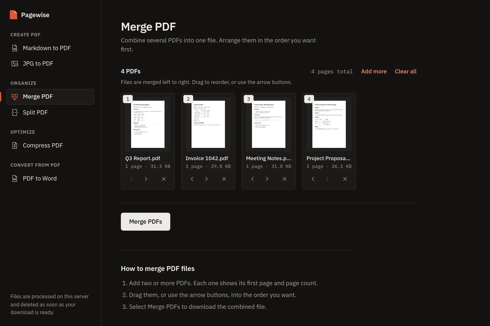
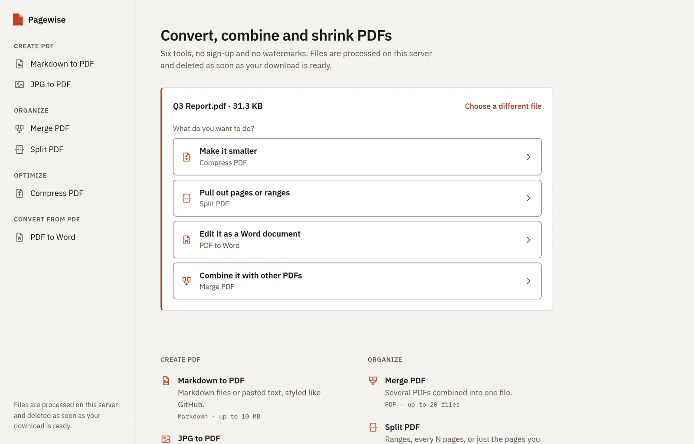
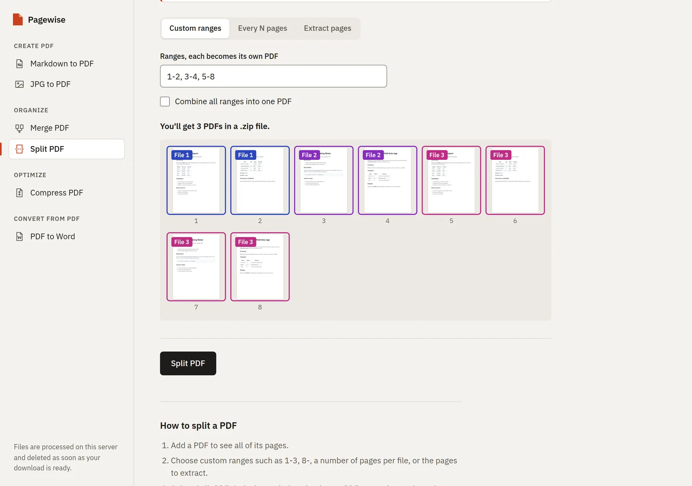
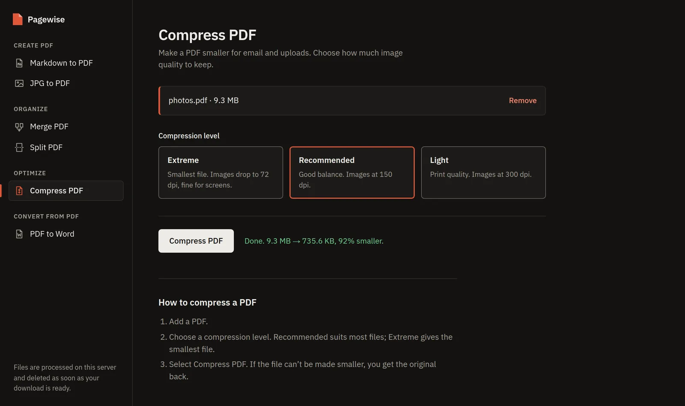
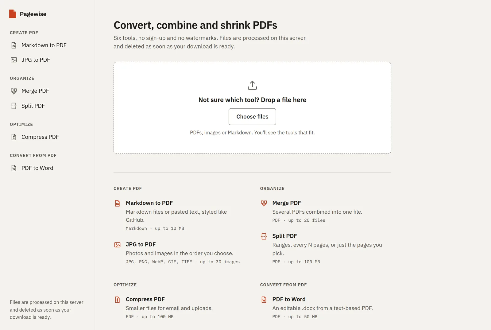
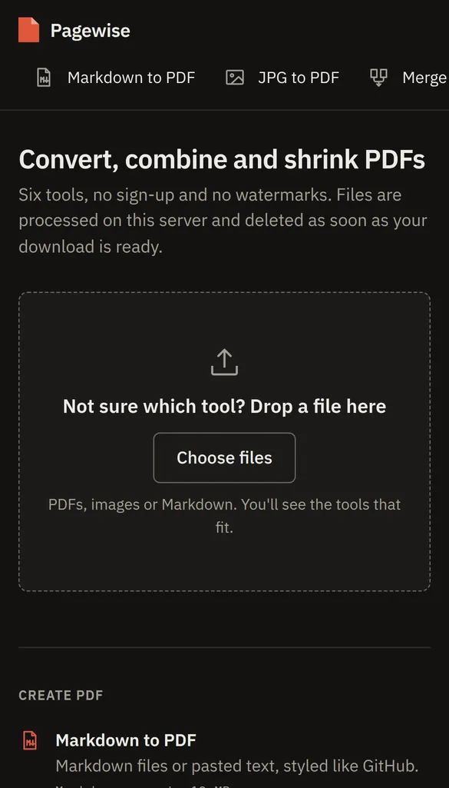
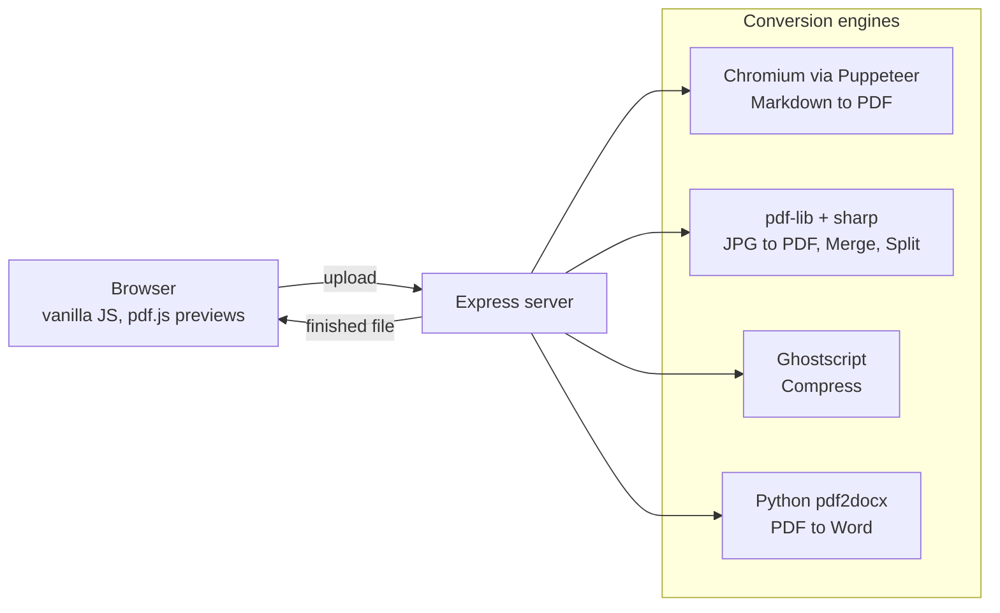

<p align="center">
  
</p>

<h1 align="center">Pagewise</h1>

<p align="center">
  Free PDF tools you can host yourself: merge, split and compress PDFs, convert images and Markdown to PDF, and turn PDFs into Word documents.<br>
  No sign-up, no watermarks, and files are deleted as soon as the download is ready.
</p>

<p align="center">
  <a href="https://md-to-pdf-zckb.onrender.com"><strong>Try the live demo →</strong></a>
  <br><br>
  <a href="#features">Features</a> ·
  <a href="#screenshots">Screenshots</a> ·
  <a href="#tech-stack">Tech stack</a> ·
  <a href="#run-it-locally">Run locally</a> ·
  <a href="#deploy">Deploy</a> ·
  <a href="docs/API.md">API</a>
</p>

<p align="center">
  
  
  
  
  
</p>



## Features

### Six tools

| Tool | What you can do |
| --- | --- |
| **[Markdown to PDF](https://md-to-pdf-zckb.onrender.com/markdown-to-pdf)** | Upload a `.md` file or paste Markdown and get a GitHub-styled PDF with tables, lists and syntax-highlighted code. |
| **[JPG to PDF](https://md-to-pdf-zckb.onrender.com/jpg-to-pdf)** | Combine up to 30 images (JPG, PNG, WebP, GIF, TIFF, AVIF) into one PDF. Pick A4, Letter or the image's own size, orientation and margins. Phone photos are turned the right way up, and JPEGs are embedded without re-compression. |
| **[Merge PDF](https://md-to-pdf-zckb.onrender.com/merge-pdf)** | Combine up to 20 PDFs. Each file shows a first-page preview and page count; put them in order by dragging or with the arrow buttons. |
| **[Split PDF](https://md-to-pdf-zckb.onrender.com/split-pdf)** | Split by custom ranges (`1-3, 5, 8-`), every N pages, or extract the pages you click. Every page is color-coded by the file it will end up in before you download. |
| **[Compress PDF](https://md-to-pdf-zckb.onrender.com/compress-pdf)** | Three levels, from extreme (72 dpi) to light (300 dpi), with a before/after size report. A 9.3 MB photo PDF drops to 735 KB on the recommended setting. You never get back a file larger than the one you uploaded. |
| **[PDF to Word](https://md-to-pdf-zckb.onrender.com/pdf-to-word)** | Turn a PDF into an editable `.docx` that keeps text, headings, tables and images. |

### Across the app

- **Not sure which tool?** Drop any file on the home page and Pagewise suggests the tools that fit ("Make it smaller", "Pull out pages"), then opens the one you pick with the file already loaded.
- **Private by design.** Files are processed in memory or in a temporary folder that is removed after every request. Nothing is stored, and fonts and scripts are self-hosted, so pages make no third-party requests.
- **Accessible.** Every action works with a keyboard and a screen reader, including reordering files. Checked against WCAG 2.2 AA with axe-core, with 0 violations.
- **Light and dark themes** that follow your system, and a layout that works down to small phones.
- **Search-friendly.** Every tool has its own server-rendered page with metadata, structured data and a sitemap. Lighthouse scores 100 for SEO, Accessibility and Best Practices.
- **Scriptable.** Each tool is a plain HTTP endpoint you can call with `curl`. See the [API reference](docs/API.md).

## Screenshots

<table>
  <tr>
    <td width="50%"><br><sub><b>Home:</b> drop a file and pick what to do with it.</sub></td>
    <td width="50%"><br><sub><b>Split:</b> pages are color-coded by output file before you split.</sub></td>
  </tr>
  <tr>
    <td width="50%"><br><sub><b>Compress:</b> choose a level and see exactly how much you saved.</sub></td>
    <td width="50%"><br><sub><b>All tools</b> grouped by what you want to do.</sub></td>
  </tr>
</table>

<p align="center">
  <br>
  <sub>On a phone, the tools become a scrolling bar at the top.</sub>
</p>

## Tech stack

| Layer | Technology | Used for |
| --- | --- | --- |
| Server | **Node.js 20**, **Express 5** | HTTP server, routing, server-rendered pages |
| | **multer**, **compression** | Upload handling with per-tool limits, gzip |
| Markdown to PDF | **markdown-it**, **highlight.js**, **github-markdown-css** | Markdown to styled HTML |
| | **Puppeteer** (headless Chromium) | Printing that HTML to a real A4 PDF |
| Images, Merge, Split | **pdf-lib** | Building, merging and splitting PDFs |
| | **sharp** (libvips) | EXIF rotation and WebP/GIF/TIFF/AVIF conversion |
| | **JSZip** | Packaging split results |
| Compress | **Ghostscript** | Image downsampling and PDF optimization |
| PDF to Word | **Python**, **pdf2docx** (PyMuPDF) | Rebuilding PDF content as an editable `.docx` |
| Frontend | **Vanilla JavaScript** (ES modules) | One module per tool, no framework and no build step |
| | **pdf.js** | Page previews in the browser |
| | **IBM Plex Sans / Mono** | Self-hosted typography |
| Deployment | **Docker**, **Render**, **AWS EC2** (systemd) | One-click blueprint or an always-on server |

### How it fits together



Tool names, URLs, page copy and SEO metadata live in one shared module (`lib/shared/tools.mjs`) used by both the server and the browser. The same goes for the Split page-range parser (`lib/shared/page-ranges.mjs`), so what the preview shows is exactly what the server produces.

## Run it locally

Requires **Node.js 20+**.

```bash
git clone https://github.com/akindu-k/pagewise.git
cd pagewise
npm install
npm start
# open http://localhost:3000
```

Markdown, JPG, Merge and Split work straight away. Two tools need an extra system dependency:

```bash
# Compress PDF: Ghostscript
sudo apt-get install -y ghostscript      # macOS: brew install ghostscript

# PDF to Word: Python with pdf2docx in a local virtualenv
sudo apt-get install -y python3-venv
npm run setup:python
```

On a minimal Linux install, Chromium may also need `sudo apt-get install -y libnss3 libnspr4 libasound2t64`.

### Configuration

| Variable | Default | Purpose |
| --- | --- | --- |
| `PORT` | `3000` | Port to listen on |
| `SITE_URL` | request host | Public URL for canonical links, the sitemap and share images, e.g. `https://pagewise.example.com` |
| `GOOGLE_SITE_VERIFICATION` | none | Google Search Console "HTML tag" verification code |
| `PDF2DOCX_PYTHON` | `.venv/bin/python`, then `python3` | Python interpreter that has pdf2docx installed |

## Deploy

- **Render:** the repo includes a `render.yaml` blueprint that builds the Docker image. [](https://render.com/deploy?repo=https://github.com/akindu-k/pagewise)
- **Docker:** `docker build -t pagewise . && docker run -p 3000:3000 pagewise`. The image includes Chromium's libraries, Ghostscript and pdf2docx.
- **AWS EC2 (always on, no cold starts):** one script sets up Node, the dependencies and a systemd service. See [deploy/DEPLOY.md](deploy/DEPLOY.md), or the step-by-step [beginner's guide](deploy/BEGINNER-GUIDE.md).

## Project structure

```
server.js                 Express app: pages, API routes, sitemap
lib/
  images-to-pdf.js        JPG to PDF (pdf-lib + sharp)
  pdf-tools.js            Merge and Split (pdf-lib, JSZip)
  compress.js             Compress (Ghostscript)
  pdf-to-word.js          PDF to Word (runs scripts/pdf_to_docx.py)
  shared/                 Modules used by both server and browser
public/
  index.html              Page template, filled in per URL by the server
  style.css               All styles, light and dark themes
  js/main.js              Client router (History API)
  js/common.js            Shared UI: drop zones, sortable file list, previews
  js/tools/*.js           One module per tool
scripts/                  pdf2docx wrapper, icon and share image generator
deploy/                   EC2 setup script and guides
docs/                     API reference and screenshots
```

## Good to know

- **PDF to Word** works best on PDFs with selectable text. Scanned pages have no text layer, so they come through as images (there is no OCR). Tables without visible borders come through as text.
- **Password-protected PDFs** are detected and rejected with a clear message. Unlock them first.
- **Limits:** Markdown 10 MB; images 30 files of 15 MB each; Merge 20 files of 50 MB each; Split and Compress 100 MB; PDF to Word 50 MB.
- **Licensing of dependencies:** Ghostscript and PyMuPDF (used by pdf2docx) are AGPL-licensed. Pagewise runs them unmodified as separate processes. Review their terms before offering Pagewise commercially.
